# App Biblioteca
Este repositorio contiene una aplicación móvil desarrollada en Flutter diseñada para la gestión de bibliotecas personales, búsqueda de libros y una experiencia social de "match" literario.

## Tecnologías Utilizadas
Framework: Flutter (Dart).

Arquitectura: Basada en Widgets y navegación por pantallas (Screens).

Integración: Conexión con APIs externas (Google Books) para la selección de etiquetas y búsqueda.

## Análisis Detallado de las Pantallas
A continuación, se describen las funcionalidades principales de cada una de las pantallas identificadas en el proyecto:

## Acceso y Registro
PantallaLogin.dart: Punto de entrada para usuarios registrados. Permite la autenticación segura para acceder a la biblioteca personal.

PantallaRegistrarse.dart: Interfaz para nuevos usuarios donde se gestiona el alta en el sistema.

## Exploración y Búsqueda
PantallaPrincipal.dart: El dashboard de la aplicación, donde se presenta un resumen de la actividad y acceso a las funciones clave.

PantallaBusqueda.dart: Motor de búsqueda de ejemplares, permitiendo encontrar libros específicos dentro del sistema o catálogo global.

PantallaEscollirTagsGoogle.dart: Pantalla especializada que utiliza la API de Google para permitir al usuario elegir etiquetas o categorías de interés, personalizando así su experiencia.

## Gestión de Biblioteca y Libros
pantallaBiblioteca.dart: Vista general de la colección de libros del usuario o de la entidad.

PantallaLlibre.dart: Ficha técnica detallada de un libro individual, mostrando sinopsis, autor y estado.

PantallaValoracio.dart: Permite a los usuarios puntuar y dejar reseñas sobre los libros leídos, fomentando la retroalimentación.

## Comunidad y Social
PantallaMatch.dart: Una funcionalidad innovadora que conecta a usuarios con libros o con otros lectores basados en intereses comunes (estilo "matching").

PantallaUsuari.dart: Perfil público o vista de otros usuarios de la comunidad.

## Perfil Personal
PantallaPerfilUsuari.dart: Centro de control del perfil propio donde se visualizan las estadísticas del lector y su colección.

PantallaEditarPerfil.dart: Permite modificar datos personales, foto de perfil y preferencias de lectura.

## Núcleo de la App
appBiblio.dart: El archivo raíz que orquestra la navegación, el tema visual de la aplicación y la configuración inicial.

## Diagrama de flujo: 

```mermaid
graph TD
    %% Inicio y Autenticación
    Start((Inicio de App)) --> AppBiblio[appBiblio.dart]
    AppBiblio --> Login[PantallaLogin.dart]
    
    Login <--> |¿No tienes cuenta?| Register[PantallaRegistrarse.dart]
    
    Login --> |Éxito| Principal[PantallaPrincipal.dart]
    Register --> |Nuevo Usuario| Tags[PantallaEscollirTagsGoogle.dart]
    Tags --> |Preferencias Guardadas| Principal
    
    %% Navegación desde Principal (Core)
    subgraph "Navegación Principal"
        Principal
    end

    Principal --> Busqueda[PantallaBusqueda.dart]
    Principal --> Biblioteca[PantallaBiblioteca.dart]
    Principal --> Match[PantallaMatch.dart]
    Principal --> Perfil[PantallaUsuari.dart]
    
    %% Detalle de Flujos Secundarios
    Busqueda --> |Ver detalle| Libro[PantallaLlibre.dart]
    Biblioteca --> |Ver detalle| Libro
    
    Libro --> |Añadir reseña| Valoracion[PantallaValoracio.dart]
    Valoracion --> |Guardar| Libro

    %% Flujo de Usuario y Edición
    Perfil --> Editar[PantallaEditarPerfil.dart]
    Editar --> |Actualizar| Perfil
    
    %% Conexiones de comunidad
    Perfil --> UnAltreUsuari[PantallaPerfilUsuari.dart]

    %% Estilos (Opcional para claridad)
    style Principal fill:#f9f,stroke:#333,stroke-width:4px
    style Login fill:#bbf,stroke:#333
    style Register fill:#bbf,stroke:#333
    style Libro fill:#dfd,stroke:#333
```

